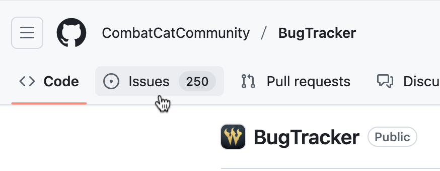
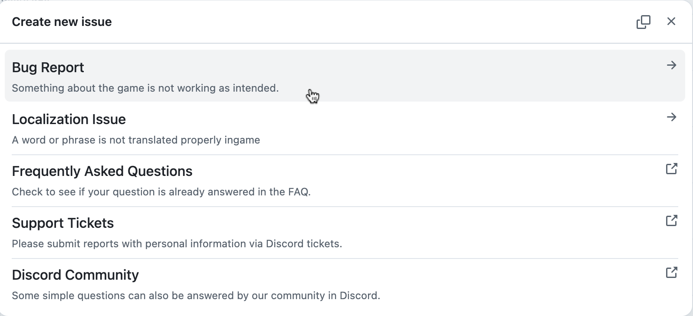
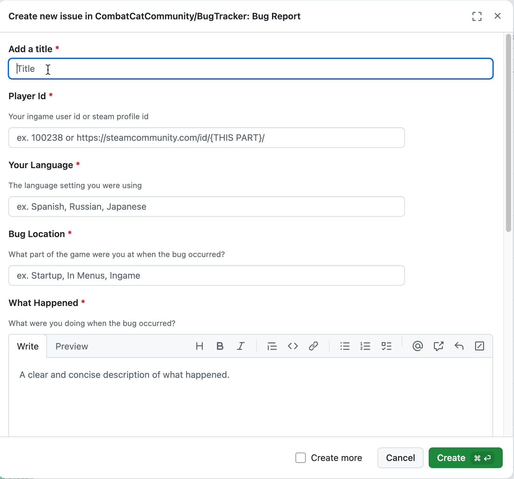
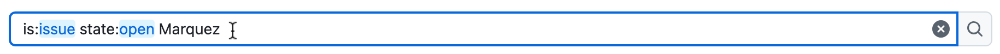
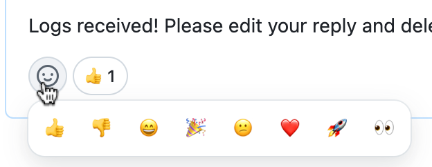
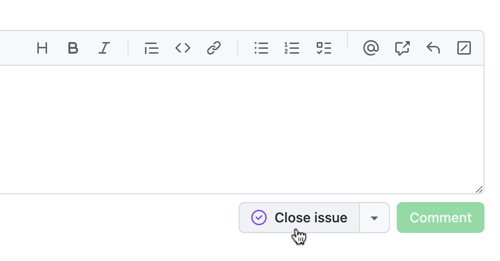

# **How To Submit A Bug Report?**

- Visit **https://github.com/CombatCatCommunity/BugTracker**

- Click on the **Issues** tab on the top left of the page.

  

- On the Issues page, click on "**New Issue**" on the top right side.

  

- Select your issue type here.

  

- Please create your `Issue Page` following our `Issue Report template`. Provide as much detail as possible, and include **screenshots or videos**.

  

 

---

 

## 💡**Login To GitHub**

- If you are not logged in to GitHub, you will be prompted to do so. Please log in.
- **If you do not have an account on GitHub, you are required to make one.** Follow the instructions on the [**GitHub Signup Page**](https://github.com/signup).

 

---

 

## **Before Submitting A Report**

- Before submitting a new report, it is recommended that you search existing Issues to see if a report similar to yours has already been made. You can do this by using the **search bar** on the Issues page.

  

- If you find an existing Issue that is similar to what you wanted to report, you should just "**Thumbs Up**" that instead of creating a duplicate report.

- You can "**Thumbs Up**" by clicking on the Emoji Icon on the bottom left corner of any comment.

  

- Additionally, you can add more information to existing Issues by commenting on those threads to help resolve them faster.

## **Closing A Report**

- Your report may be closed if a Combat Cat Studio member has attended to it or marked it as resolved.
- You can close your own reports too if you have made a mistake in your submission or if the bug has now been fixed. You can find the "Close issue" button at the bottom of the page on your Issue.

  
